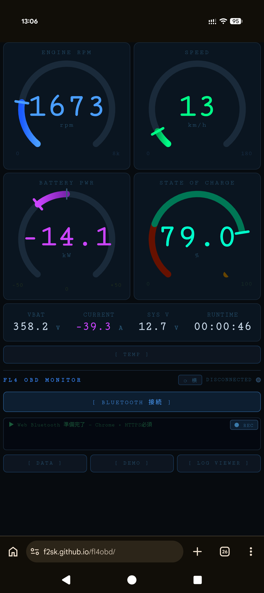

# 🚗 FL4 OBD MONITOR

Honda Fit (GR系) / フィットe:HEV 向け OBD-II リアルタイムモニター。
ELM327 BLE ドングル経由でアナログメーター表示・HVバッテリー監視・ログ記録ができる Web アプリ。

**[ツールを開く →](https://f2sk.github.io/fl4obd/)**



---

## 必要なもの

- **Android スマートフォン**（Chrome ブラウザ）
- **ELM327 BLE OBD-II ドングル**（Bluetooth 4.0以降対応のもの）
- OBD-II ポートへの接続（車両エンジン始動または IG-ON 状態）

> iOS (Safari) は Web Bluetooth 非対応のため使用不可。

---

## 起動手順

1. OBD-II ドングルを車両の OBD ポートに挿す（運転席足元のダッシュボード下）
2. スマートフォンの Bluetooth をオンにする
3. `index.html` を Chrome で開く（ローカルファイルまたは HTTPS ホスト）
4. **[ BLUETOOTH 接続 ]** をタップ
5. スキャン結果からドングルを選択
6. `CONNECTED` と表示されれば接続完了、データが自動的に表示される

---

## 画面説明

### アナログメーター（上部 2×2）

| メーター | 表示内容 | 範囲 |
|---------|---------|------|
| ENGINE RPM | エンジン回転数 | 0〜8,000 rpm |
| SPEED | 車速 | 0〜180 km/h |
| BATTERY PWR | HVバッテリー電力（橙=放電、紫=充電） | −50〜+50 kW |
| STATE OF CHARGE | HVバッテリー残量 | 0〜100 % |

### サブ行（メーター下）

| 項目 | 内容 |
|------|------|
| VBAT | HVバッテリー電圧 [V] |
| CURRENT | HVバッテリー電流（正=放電、負=充電）[A] |
| SYS V | 12V系補機バッテリー電圧 [V] |
| RUNTIME | エンジン始動からの経過時間 |

---

## ボタン操作

| ボタン | 動作 |
|--------|------|
| **[ BLUETOOTH 接続 ]** | BLE スキャン開始・接続 / 接続中は切断 |
| **⟳ 横** | メーターを横向き表示に切替（端末の向きにも自動追従） |
| **● REC** | ログ記録開始。もう一度タップで停止→テキストファイルをダウンロード |
| **[ DEMO ]** | 未接続時に模擬データで動作確認（接続中は無効） |

---

## ログ記録

1. **[ ● REC ]** をタップして記録開始
2. 走行・操作を行う
3. **[ ■ STOP ]** をタップ → `fl4obd_YYYY-MM-DDTHH-MM-SS.txt` がダウンロードされる

ログにはタイムスタンプ付きで送受信コマンドと解析結果が記録される。

---

## よくある問題

**接続できない**
- Bluetooth がオンになっているか確認
- ドングルが OBD ポートに正しく挿さっているか確認
- Chrome ブラウザを使用しているか確認（Safari・Firefox 不可）
- ページが HTTPS または localhost で開かれているか確認

**データが `--` のまま**
- エンジンが始動しているか確認（IG-ON 以上が必要）
- ログに `NO DATA` が連続している場合はドングルの相性問題の可能性あり

**BATTERY PWR / VBAT が表示されない**
- PID 0x9A のマルチフレーム応答が届いていない可能性あり。ログで `[9A] FF=` の行を確認

**SYS V が表示されない**
- PID 0x42 の応答確認。ログに `410042` を含む行があるか確認

---

## ホスティング（PC から Android に配信する場合）

```bash
python -m http.server 8080
# スマートフォンから http://<PCのIPアドレス>:8080/index.html を開く
```

GitHub Pages 等の HTTPS 環境に置いても動作する。
