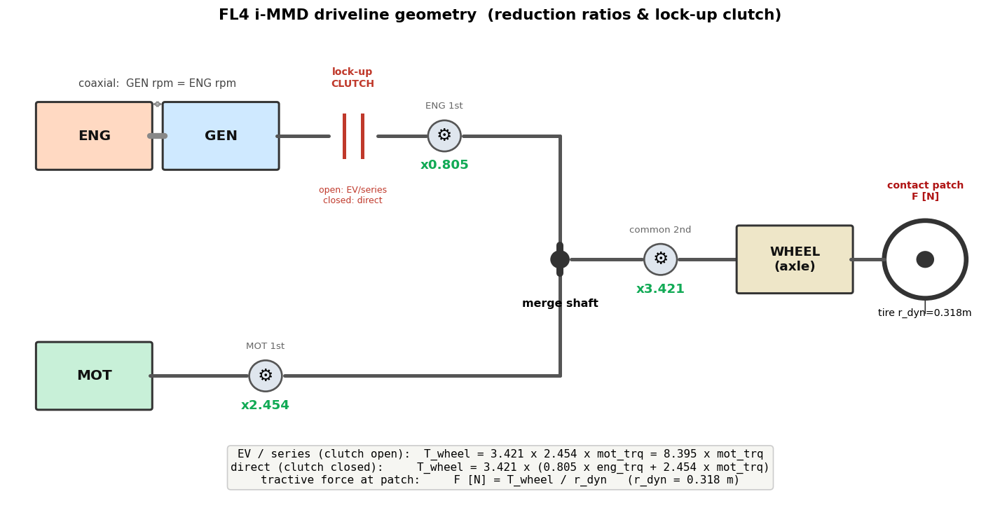

# 🚗 FL4 OBD MONITOR

Honda CIVIC e:HEV (FL4) 向け OBD-II リアルタイムモニター。
ELM327 BLE ドングル経由で、アナログメーター表示・**i-MMD エネルギーフロー図**・HVバッテリー監視・ログ記録ができる Web アプリ。

| | |
|---|---|
| **モニター** | [https://f2sk.github.io/fl4obd/](https://f2sk.github.io/fl4obd/) |
| **ログビュワー** | [https://f2sk.github.io/fl4obd/viewer.html](https://f2sk.github.io/fl4obd/viewer.html) |
| **走行リプレイ** | [https://f2sk.github.io/fl4obd/replay.html](https://f2sk.github.io/fl4obd/replay.html) |

---

## 必要なもの

- **Android スマートフォン**（Chrome ブラウザ）
- **ELM327 BLE OBD-II ドングル**（Bluetooth 4.0以降対応のもの）
- OBD-II ポートへの接続（車両エンジン始動または IG-ON 状態）

> iOS (Safari) は Web Bluetooth 非対応のため使用不可。

---

## 起動手順

1. OBD-II ドングルを車両の OBD ポートに挿す（運転席足元のダッシュボード下）
2. スマートフォンの Bluetooth をオンにする
3. [このページ](https://f2sk.github.io/fl4obd/) を Chrome で開く
4. **[ BLUETOOTH 接続 ]** をタップ
5. スキャン結果からドングルを選択
6. `CONNECTED` と表示されれば接続完了、データが自動的に表示される

---

## 画面説明

上部の **GAUGE / FLOW タブ**で2つの表示を切り替えられる。

### GAUGE（アナログメーター 3×2）

| メーター | 表示内容 | 範囲 |
|---------|---------|------|
| Vsp | 車速 | 0〜180 km/h |
| Psys | システム出力（車輪出力。橙=駆動、紫=回生） | −140〜+140 kW |
| Peng | エンジン出力 | 0〜110 kW |
| Pbat | HVバッテリー電力（橙=放電、紫=充電） | −50〜+50 kW |
| ENGrpm | エンジン回転数 | 0〜8,000 rpm |
| Psoc | HVバッテリー残量（SOC） | 0〜100 % |

メーター下のテキスト行：

| 項目 | 内容 |
|------|------|
| RUN MODE | 動作モード（EV / SERIES / DIRECT）。EV↔他モードの遷移コードは直前モードを保持し中間表示を抑制 |
| Vsys | 12V系補機バッテリー電圧 [V] |
| RUNTIME | エンジン始動からの経過時間 |

### FLOW（エネルギーフロー図）

i-MMD（2モーターHV）の電力の流れを、**ENG / GEN / MOT / BAT / AUX-AC ＋ 車輪**のノード間を結ぶ矢印で可視化する。
中央の電気バス（◎）に GEN・MOT・BAT・AUX が接続され、走行モードごとに流れの向き・色・太さが変化する。

- **色** … 経路：機械=橙／電気=シアン、状態：回生=緑、補機=紫
- **線の太さ・矢じり** … 電力の大きさ [kW]（大きいほど太い）
- **向き** … パワーの方向（力行 ↔ 回生で反転）
- **AUX/AC ノード** … 電気バスで収支の合わない分（DC-DC・12V系・A/C 等の補機消費）を集約。表示はエネルギー保存を満たす
- **エンブレ廃電** … SOC 満充電時、回生電力を GEN でエンジンを回して（エンジンブレーキ）熱で捨てる制御。GEN↔ENG が通常と逆向き（bus→GEN→ENG）になり、ENG に「廃電」バッジが出る
- **中央上段** … 現在のモード（EV / SERIES = 水色、DIRECT = 橙）
- **各ノード数値** … ENG=回転数、車輪=車速、BAT=SOC

> **データ取得**：車両/パワトレ系（Vsp・Psys・Peng・Pbat・ENGrpm・RunMode・GEN/MOTトルク）は
> パワトレECU(0x07)の拡張DID `2920` を1本読むだけで取得（UDS Service 22、マルチフレーム）。
> SOC は PID `015B`（3秒毎）、12V は PID `0142`（10秒毎）。変化の遅いこれらを間引いて 2920 の枠を確保し、2920 は ~2Hz（往復 ~450ms が BLE 律速の上限）で取得。
> Peng = 2.09e-6 × eng_trq × ENGrpm、車輪出力 = 0.000147 × drv_trq × Vsp、
> P_gen = `gen_trq`（0.0374 Nm/LSB）× ENGrpm（ENG-GEN 同軸）から算出。

---

## 信号の同定について（技術レポート）

本アプリが表示する各パラメータ（動作モード・各軸回転数・バッテリ電力・モーター/エンジン/発電機トルク・車輪出力・踏面駆動力など）は、Honda Civic FL4（i-MMD）のパワトレECU（`0x07`）が返す UDS Service 22 拡張DIDを、**公開情報（標準OBD-II PID・車両諸元・実走ログ）と物理法則のみ**でリバースエンジニアリングして同定したものである。メーカー内部資料は用いていない。

各信号の同定手法・根拠・変換係数・限界、および車輪出力／踏面駆動力の再構成は、技術レポートにまとめている。

📖 **[解析レポート（Markdown・GitHubでそのまま閲覧）](docs/did-analysis/fl4-did-analysis.md)** ／ 📄 **[PDF版（全20p, 2段組）](docs/did-analysis/fl4-did-analysis.pdf)**

---

## ボタン操作

| ボタン | 動作 |
|--------|------|
| **GAUGE / FLOW** | 上部タブ。アナログメーターとエネルギーフロー図を切替（左右スワイプでも切替可） |
| **[ BLUETOOTH 接続 ]** | BLE スキャン開始・接続 / 接続中は切断 |
| **● REC** | ログ記録開始。もう一度タップで停止→テキストファイルをダウンロード |
| **[ GPS ]** | GPS(GPX)記録の有効/無効。ON 中に REC で録画すると、停止時に GPX も同時出力 |
| **[ IMU ]** | 加速度・ジャイロ(IMU)記録の有効/無効。ON 中に REC で録画すると、停止時に生サンプルの CSV（`fl4obd_imu_*.csv`）を同時出力。時刻は他ログと同じ UTC(ISO)。車両座標化・慣性/勾配分離・融合は解析側で行う前提の生データ |
| **[ DEMO ]** | 未接続時に模擬データで動作確認（接続中は無効） |

---

## ログ記録

1. **[ ● REC ]** をタップして記録開始
2. 走行・操作を行う
3. **[ ■ STOP ]** をタップ → `fl4obd_YYYY-MM-DDTHH-MM-SS.txt` がダウンロードされる

ログにはタイムスタンプ付きで送受信コマンドと解析結果が記録される。

---

## ログビュワー

記録したログファイルをグラフで可視化できる。**[viewer.html](https://f2sk.github.io/fl4obd/viewer.html)** を開き、ログファイルをドラッグ&ドロップするだけで動作する。上部の **GRAPHS / FLOW タブ**で切替える。

### GRAPHS（各変数のグラフ）

| チャート | 表示内容 |
|---------|---------|
| SPEED / MODE / SOC | 車速・動作モード・SOC |
| RPM / P_eng | エンジン回転数・エンジン出力 |
| P_wheel / P_bat | 車輪出力・HVバッテリー電力（DID 2920 から算出） |
| SYSTEM VOLTAGE | 12V系補機バッテリー電圧 |

- **グラフをドラッグ**すると、その時刻に縦カーソルが移動し、**FLOW タブのエネルギーフロー図がその瞬間の状態に同期**する（時刻はタブ間で共有）。

### FLOW（フロー再生）

デバッグログ内の DID `2920` を1フレームずつ再生し、モニター画面と同じ **i-MMD エネルギーフロー図**（ENG/GEN/MOT/BAT/AUX-AC ＋車輪）をアニメーション表示する。

- **▶ 再生 / ⏸ 一時停止**、**再生速度**（0.25×〜16×）、**シークバー**で任意位置へ
- 再生位置は GRAPHS タブの縦カーソルと双方向に同期

対応ファイル形式：
- `fl4obd_*.txt`（デバッグログ）… GRAPHS 全チャート＋FLOW 再生に対応
- `fl4obd_data_*.csv`（旧データログ・現行アプリは非出力）… GRAPHS のみ（2920 生フレームを含まないため FLOW 非対応。ビュワーは互換のため引き続き読込可）

## 走行リプレイ（地図＋GPS）

GPS 付きの走行を OpenStreetMap 上で再生する。**[replay.html](https://f2sk.github.io/fl4obd/replay.html)** を開き、**GPX（GPSトラック）とフレームログ（.txt）の2ファイル**を読み込むと、3画面ダッシュボードで同期再生する。

- **俯瞰**：走行コース全体（走行済み＝明／未走行＝暗、始点・終点・現在地）
- **ナビ**：自車を中心に地図が動く（北固定・ズーム可変）
- **パワーフロー**：その時刻の i-MMD エネルギーフロー図

走行線は**モードで色分け**（EV/SERIES/DIRECT）・**車速で線幅**・白フチ付きで、下地の道路色に埋もれない。**📊 サマリー** ボタンで走行距離・時間（総／走行）・平均車速（総／走行中）・電費（∫Peng+∫Pbat／距離）、消費エネルギーの内訳（消費＝駆動+AUX、うち回生を除いた分が電費）、走行中の EV/SERIES/DIRECT 配分を時間・距離の2軸でスロープ図表示する（各モードの時間比と距離比をリボンで結び、シフトが分かる）。

**📈 グラフ** ボタンで、時間軸に沿った 標高・勾配・車速・足軸/電池パワー・SOC・エンジン回転数・モード帯の時系列を表示（**赤線＝現在時刻は常に中央**で、再生とともにグラフがスクロール。**左右ピンチ（PCはマウスホイール／トラックパッドのピンチ）で赤線を中心に時間軸ズーム**。時刻移動は下の再生バーで）。

再生バー（再生/停止・シーク・速度 1〜10×）で任意位置へ。サマリー/グラフのパネルは再生バーを覆わないので、開いたまま再生・シークできる。GPX と .txt は時刻（UTC）で自動結合する。GPS ログはモニター画面の **[GPS] トグル**を ON にして録画すると出力される。

---

## よくある問題

**接続できない**
- Bluetooth がオンになっているか確認
- ドングルが OBD ポートに正しく挿さっているか確認
- Chrome ブラウザを使用しているか確認（Safari・Firefox 不可）
- ページが HTTPS または localhost で開かれているか確認

**データが `--` のまま**
- エンジンが始動しているか確認（IG-ON 以上が必要）
- ログに `NO DATA` が連続している場合はドングルの相性問題の可能性あり

**走行中に切れる / データが止まる**
- BLE が切れても**自動で再接続**する（`bleDevice` を保持し `gatt.connect()` を指数バックオフで再試行。状態は `RECONNECTING` 表示。手動で `[ 切断する ]` を押すと自動再接続は止まる）。無応答が続く張り付きも検知して能動的に再接続する
- **別アプリを前面に出す／画面ロックすると取得は止まる**（Android Chrome がバックグラウンドのタイマー/BLE処理を停止するため。Web の制約で回避不可）。前面に戻すと自動的にポーリングを再開する。連続ロギングは**アプリを画面に出したまま**行う（画面はウェイクロックで消えない）。画面OFF放置で撮りたい場合は実機ロガー（ATmega/Pico）の領分

**BATTERY PWR / VBAT が表示されない**
- PID 0x9A のマルチフレーム応答が届いていない可能性あり。ログで `[9A] FF=` の行を確認

**SYS V が表示されない**
- PID 0x42 の応答確認。ログに `410042` を含む行があるか確認

