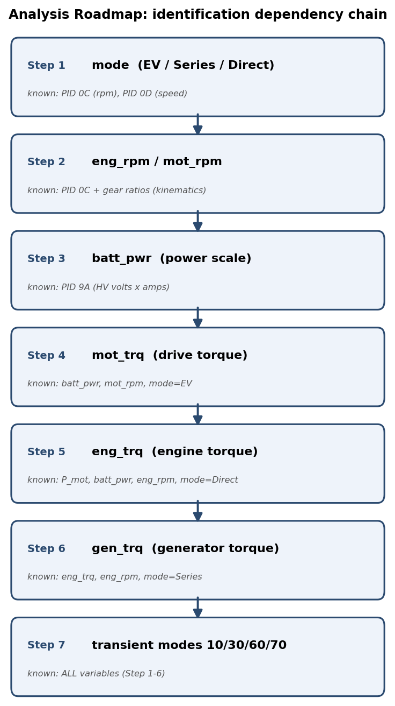
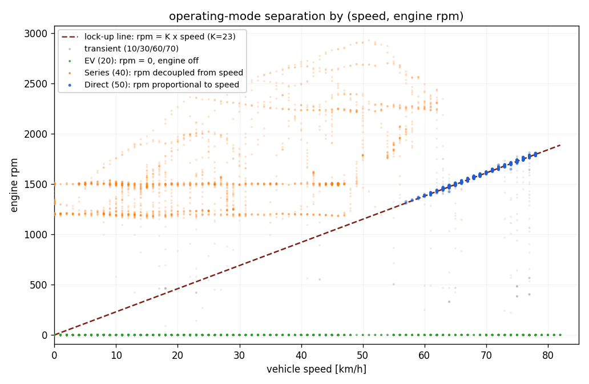
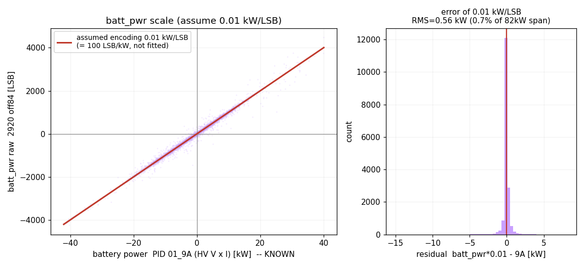
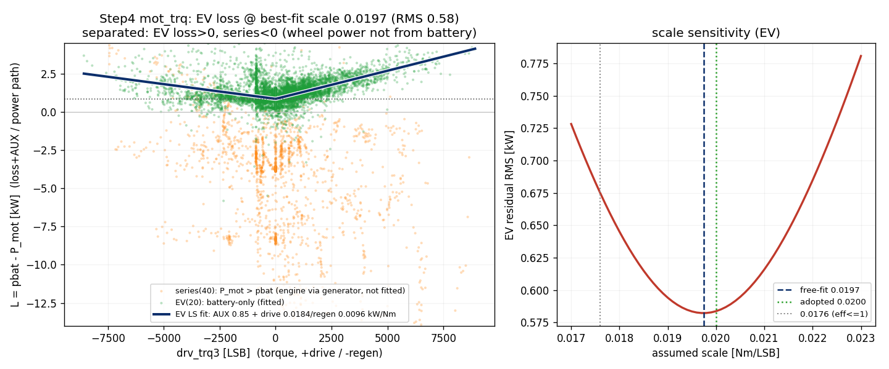
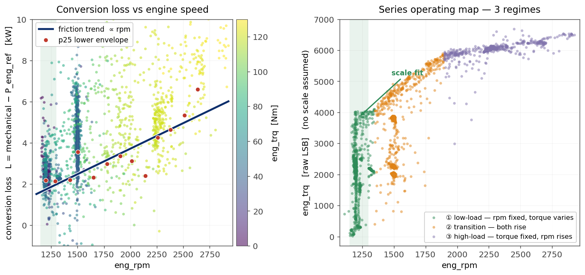
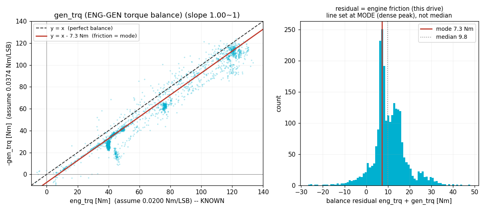
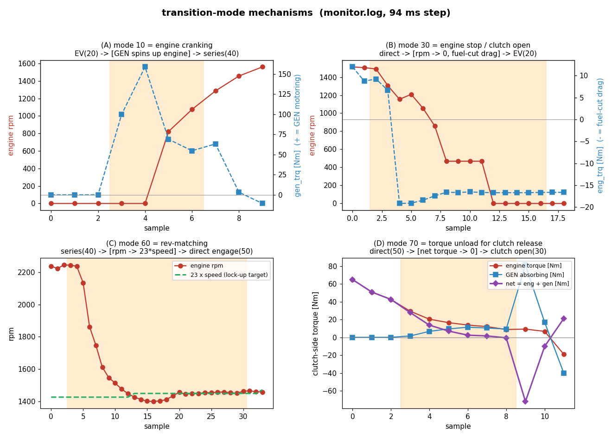
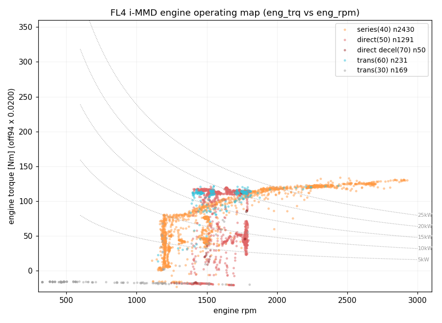
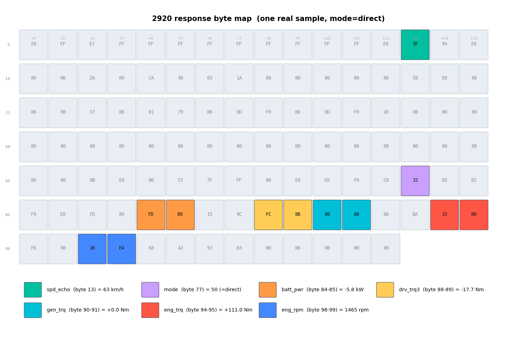
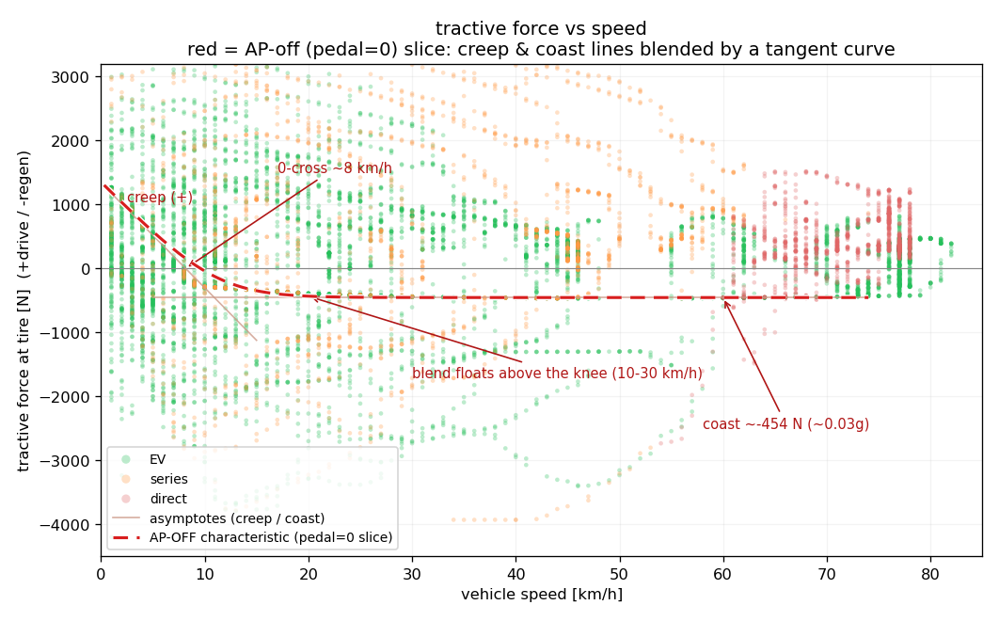

# Honda Civic FL4（i-MMD）パワートレインECU 拡張DID リバースエンジニアリング解析

### — UDS Service 22（Physical Address `0x07`）の物理量同定 —

**Author:** f2sk（fl4obd Project）
**Version:** 1.1（2026-07）

---

## Abstract

本レポートは、Honda Civic FL4（2モーターハイブリッド機構 i-MMD 搭載）のパワートレイン系ECU（Physical Address `0x07`）が返す UDS Service 22 拡張DID（診断識別子）について、各フィールドの物理的意味と変換係数をリバースエンジニアリングにより同定した記録である。

Honda はこれらDIDの構造を公開していない。そのため解析には、外部から観測できる情報のみを用いた。具体的には、標準OBD-II PID（SAE J1979-2）、車両の公表諸元（減速比・タイヤ径）、および実走行で取得した診断通信ログである。標準PIDとの相関、諸元から導いた運動学的拘束、エネルギー保存則に基づく物理的整合を組み合わせ、各信号を物理量へ対応付けた。

その結果、動作モード（EV／シリーズ／直結および各遷移状態）、モーター回転数、エンジン回転数、バッテリ電力、モータートルク、エンジントルク、発電機トルクを同定した。さらに、同定した信号から車輪出力・車輪トルク・踏面駆動力をモード別に再構成できることを確認した。

一部の係数（特にエンジントルクのスケール）は推定である（低負荷レジームの実測に基づき 0.0200 と見積もった）。本レポートでは、それらの根拠・限界を各所に明示する。

本手法はメーカー内部資料に依存せず、公開情報と物理法則のみで未文書化の診断データを同定する。この点で、他のHonda車種や他ECUの未知DID解析へ応用できる可能性がある。

---

## Key Findings

- ECU `0x07` の主要拡張DID（`2920`〜`2923`）のフィールドを同定した。
- 定常3モード（EV／シリーズ／直結）と各遷移モード（`10`/`30`/`60`/`70`）の機序を解読した。
- モーター・エンジン・発電機のトルクを物理量（Nm）として較正した。
- バッテリ電力を電力の物差し（0.01 kW/LSB）として同定した。
- モード別の車輪出力・車輪トルク・踏面駆動力を再構成した。
- エンジントルクのスケールは推定であること（低負荷レジームの実測から 0.0200 と見積もり、縮退によりさらなる高精度確定は不可）、および総駆動力・制動要求フィールドが `0x07` に存在しないことを、限界として整理した。

---

## 目次

1. はじめに
2. 解析対象
3. 解析手法
4. 解析結果
5. DIDフィールドマップ
6. 考察
7. 制約・未解決事項
8. まとめ
- 参考文献
- 更新履歴

---

## 1. はじめに

本レポートで判明した主要な内容は、ECU `0x07` の拡張DIDに含まれる動作モード・各軸回転数・バッテリ電力・各部トルクを、公開情報のみで物理量として同定できたことである。以下では、その前提と方針を述べる。

拡張DIDの中身はメーカー非公開である。したがって、内部仕様を参照せず、外部から観測できる手掛かりのみで内側を推定する方針を採る。

足場にできる外部情報は、次の3種類である。

- **標準PID（SAE J1979-2 準拠）**：車速・エンジン回転数・HV電池電圧/電流など。物差しとなる参照信号である。
- **公表諸元**：減速比・タイヤサイズ。各軸回転数を運動学的に固定する幾何アンカーである。
- **物理法則**：運動学およびエネルギー保存則。相関だけでは経験定数に留まる係数を、物理スケールへ引き上げる拘束である。

どのECU・どのDIDに制御パラメータがあるかも未知である。そのため、まず機能アドレスへの Service 22 で応答ECUとDIDを総当りで探索した（§2.1）。有望と判断した `0x07` のDIDから、生データ（各109バイトの構造体ブロック）を収集した。

解釈の指針として、Honda の2モーターハイブリッド機構 **i-MMD** の方式から推定される制御ロジックを用いた。i-MMD は EV／シリーズ／直結の3モードを持つ。発電機はエンジンと同軸に、走行用モーターは駆動軸に固定比で結合する。これらの構造的前提が、モード分離とトルク同定の枠組みを与える。

本レポートは、個別のマッピング結果だけでなく、公開情報と物理法則を積み上げて未知信号を段階的に同定する再現可能な手順も示す。

## 2. 解析対象

### 2.1 対象DIDの探索

車両制御パラメータがどのECUのどのDIDにあるかは未知であった。そのため、次の手順で総当り探索した。

1. 機能アドレス（Functional Addressing）`0x18DB33F1` に Service 22 をブロードキャストし、応答するECU（＝物理アドレス）を把握した。
2. DID を `0x0000`〜`0xFFFF` まで全走査し、正応答（`0x62` + DID + データ）を返すDIDを収集した。
3. 応答は複数ECUから返った。その中で **Physical Address `0x07`** のDID群に、走行状態で大きく変動する値（rpm・車速・トルク等）が集中していた。中身からパワトレ系のECUと判断し、以降これを解析対象とした。
4. 特に **`0x2900`〜`0x2933`** のブロック群が、EV／シリーズ／直結や加減速に応じた動きを示した。制御パラメータを含む有望DIDと判断した。
5. 以降、これらDIDの生バイトを参照PID（標準OBD-II）や諸元と照合し、各信号を同定した（§4以降）。

各DID応答は **109バイト** の構造体ブロック（ISO-TP マルチフレーム）で返る。1ブロックに多数の信号が詰め込まれている。どのビット位置が何を表すかを、本レポートの同定作業で明らかにする。

### 2.2 取得データと既知定数

**実走ログ**：Arduino UNO + MCP2515 で `0x07` を UDS Service 22 でポーリングし、各DIDの生ブロックと参照PIDをCSVへ記録した（約16分×複数走行、EV／シリーズ／直結・停車充電を含む）。

**参照PID（J1979-2）** を表1に示す。

**表1. 参照に用いた標準PID**

| PID | 物理量 | 変換 |
|---|---|---|
| 01 0x0C | エンジン回転数 | (256A+B)/4 [rpm] |
| 01 0x0D | 車速 | A [km/h] |
| 01 0x9A | HV電池 電圧/電流 | V=(…)/64、I=符号付き×0.1 → 電力 pbat=V·I |
| 01 0x5B | SOC | 100A/255 [%] |
| 01 0x11 | スロットル位置 | 100A/255 [%] |

**公表諸元（幾何アンカー）** を表2に示す。

**表2. 公表諸元（幾何アンカー）**

| 項目 | 値 |
|---|---|
| 第一減速比 | 2.454（電動機駆動）／0.805（内燃機関駆動） |
| 第二減速比（共通） | 3.421 |
| タイヤ | 235/40ZR18（外径645.2mm、動的周長≈1.996m） |

第一減速比が電動機と内燃機関で別値であり、第二減速比が共通である。この事実は、走行用モーターとエンジンが合流軸を共有し、その後の第二減速比を共通に通って車輪へ至る構成を意味する。ここから各軸回転数の関係が確定する（§4.2）。

駆動系の構成をFig1に示す。エンジンと発電機はロックアップクラッチを挟んで同軸に並ぶ。走行用モーターは別系統（第一減速比 2.454）で合流軸に噛み合う。直結モードではクラッチが締結し、エンジントルクが第一減速比 0.805 で合流軸へ伝わる。


**Fig1. 駆動系構成。** 走行用モーター（×2.454）とエンジン＋発電機・ロックアップクラッチ系（×0.805）が合流軸で結合し、共通の第二減速比（×3.421）を経てタイヤ（動的半径 0.318m）で踏面に至る。この幾何が §4.2 の回転数拘束および §5 の車輪トルク・踏面駆動力換算の基礎となる。

**対象DID**：`22_2900`〜`22_2933` 等（各109バイトの構造体ブロック）。

**用語**：本レポートでは、2モーターハイブリッドの走行用モーター（駆動モーター）を `mot`、発電用モーター（ジェネレータ）を `gen`、エンジンを `eng` と表記する。

## 3. 解析手法

本章では、各信号の同定に用いた手法を述べる。手順は、探索・相関・モード分離・運動学アンカー・X×ω検定・エネルギー保存・スケール導出からなる。

**相関スキャン**：各DIDブロックの全バイトを16bit整数（BE＝Big Endian、上位バイト先頭。以降 `BE` はこの意味）として切り出す。これを参照信号（rpm／車速／pbat／加速度 dv/dt）と相関させる。

記法として、各信号を **(start bit, bit length, バイトオーダ, 符号)** で定義する（DBC/ARXML 標準）。start bit はブロック先頭byteを0としたビット位置（＝byte位置×8）である。`BE`=Motorola（上位バイト先頭）、符号は `s`(signed)/`u`(unsigned) を表す。信号は短い信号名で参照し、ビット配置は §5 の表へ集約する（例：`mot_trq` = 2923, start 136, len 16, BE, s）。

**モード分割**：エンジンrpmと車速の関係から、EV／シリーズ／直結を区別する。

**運動学アンカー**：諸元の減速比とタイヤ径から各軸の角速度を厳密化する。これを回転数フィールドの同定と、トルクの物理スケール確定に用いる。

**X×ω 検定**：候補が「トルク」か「電力」かを判別する。電力＝トルク×角速度である。候補 X に角速度 ω（mot なら mot角速度、eng なら eng角速度）を掛けた `X×ω` が電力に一致すれば、X はトルクである。

**エネルギー保存**：直接観測できないエンジン出力を、`P_eng ≈ P_mot − pbat`（エンジン機械出力＝モーター出力＋充電＋損失）で基準化する。

**フィット手法**（再現性のため明記する）：各較正は「回帰で係数を測る」のではなく、**設計者の丸め値または既知係数を当て込み、残差で妥当性を評価する**。既知の物理量を横軸に、未知フィールドを縦軸に当て込む構図である。

- **スケール確定**：丸め値（`0.01 kW/LSB`、`0.0200 Nm/LSB` 等）を当て込み、残差RMSで検証する。
- **オフセット**（AUX・固定損・内部フリクション等の走行条件依存量）：傾きを固定した上で零点近傍の切片として決定する。損失が電力とともに増えて残差が歪む場合は、損失項（駆動/回生の線形項）も同時に最小二乗し、切片としてオフセットを分離する（AUX：§4.4）。損失項を明示せず残差分布だけを見る場合は、歪みに引かれる平均でなく最頻値（＝密集帯の代表値）を採る（内部フリクション：§4.6）。
- **損失を含む散布**（エンジン電気経路効率）：外れ値に強く密集帯を通す Theil-Sen 頑健回帰を用いる。
- 較正に用いたデータは `monitor.log`（10.5Hz、`mode` フラグと独立な `01_9A`＝HV電圧×電流を含む）である。オフセット類はこの走行での値であり、空調・暖機で変わる。

## 4. 解析結果

同定は依存連鎖で進む。外部アンカー（標準PID・諸元）だけを足場に Step1 を確定し、その成果を物差しに次段を確定する。全体の依存関係をFig2に示す。各較正図は §3 の方針どおり「既知の物理量（横軸）に未知フィールド（縦軸）を当て込み、残差で妥当性を評価する」構図で読める。



**Fig2. 解析ロードマップ。** Step1（mode）を外部既知だけで確定し、その成果を順に物差しとして Step2〜7 を同定する依存連鎖を示す。

同定ロードマップを表3に示す。

**表3. 同定ロードマップ**

| Step | 確定する変数 | 使う既知（前段の成果） | 図 |
|---|---|---|---|
| 1 | `mode`（定常3モード EV/SER/DIR） | N(0x0C)・車速 | Fig3 |
| 2 | `eng_rpm`・`mot_rpm` | N(0x0C)・諸元運動学 | （数値検証） |
| 3 | `batt_pwr`（電力の物差し） | pbat(0x9A) | Fig4 |
| 4 | `mot_trq` | pbat(S3)・ω_mot(S2)・mode=EV(S1) | Fig5 |
| 5 | `eng_trq` | mode=直結(S1)・P_mot(S4)・pbat(S3)・eng_rpm(S2) | Fig6 |
| 6 | `gen_trq` | eng_trq(S5)・mode=シリーズ(S1)・eng_rpm(S2) | Fig7 |
| 7 | 過渡モード(10/30/60/70)の機序 | 上記全変数(S1-6) | Fig8 |
| 傍証 | エンジン動作マップ | eng_trq・eng_rpm(S5) | Fig9 |

過渡モードを後回しにする理由は、依存関係にある。EV／シリーズ／直結の定常3モードは、rpm-車速の関係だけ（外部既知）で判別できる。一方、過渡コードの機序は、後段で確定するトルク等の変数が揃って初めて各部の挙動を比較でき、同定される。よって Step1 では定常3モードのみを確定し、過渡モードは全変数の同定後（Step7・§4.7）に提示する。

### 4.1 Step1 動作モード `mode`（定常3モード）

本節では、`mode` = 0x2920 (616, 8, —, flag) の定常3モード（EV／シリーズ／直結）を同定した。以下、その根拠を示す。

**使う既知**：N(0x0C)・車速。**確定する量**：定常3モードとロックアップ比 K。これは以降の全式の切替キーである。

**手法**：離散値（少数の値しか取らない）バイトを探索し、値ごとに (車速, rpm) が分離するものを抽出した。定常3モードは rpm-車速の関係だけ（外部既知）で分離できる。分離結果を表4に示す。

**表4. 定常3モードの同定根拠**

| mode | モード | 同定根拠（rpm-車速のみ） |
|---|---|---|
| `20` | EV | rpm=0（エンジン停止） |
| `40` | シリーズ | rpm が車速と無関係（発電動作点）＝ rpm/車速 がばらつく・低速 |
| `50` | 直結（駆動/巡航） | rpm ∝ 車速（傾き＝ロックアップ比 K≈23、σ≈0.1 で線上に密着） |

副産物として、ロックアップ比 **K = 23.0 rpm/(km/h)** を確定した（`50` の rpm/車速 から）。この比は実時間のモード判定にも使える（`rpm=0`⇒EV／`rpm≈K·車速`⇒直結／それ以外の稼働⇒シリーズ）。

`mode` はこの3値のほかに過渡的な値（`10`/`30`/`60`/`70`）も取る。この段階で分かるのは、それらが過渡であることだけである。各機序の同定には、後段で確定する他の変数（各部トルク等）が必要になる。そのため過渡モードは全変数の同定後、§4.7（Step7）で扱う。



**Fig3. 動作モードの分離。** 各 `mode` 値ごとの (車速, エンジンrpm) の分布。EV（rpm=0）、シリーズ（rpm が車速と無相関）、直結（rpm ∝ 車速、傾き K）が分離する。

### 4.2 Step2 回転数フィールド `eng_rpm`・`mot_rpm`（諸元アンカーによる検証）

本節では、回転数フィールドを諸元運動学で検証し、各軸の角速度を 2920 内で確保した。これにより、以降のトルクを経験定数でなく物理スケール（Nm/LSB）で確定できる土台が整う。

**使う既知**：N(0x0C)・諸元運動学。**手法**：諸元から予言される値への直接一致による検証である。未知係数を測るのではなく、既知の傾きにデータが乗るかを確認する。

諸元の減速比とタイヤ径から、各軸の回転数は車速に対して一意に決まる。

- 常時（mot は駆動軸固定比）：

  `mot_rpm = 2.454 × 3.421 × 車輪rpm ≈ 70.1 × 車速[km/h]`　　(1)

- 直結時（eng がロックアップ）：

  `eng_rpm = 0.805 × 3.421 × 車輪rpm ≈ 23.0 × 車速`　　(2)

- 両式の比より、直結で `mot_rpm = (2.454/0.805) × eng_rpm = 3.048 × eng_rpm`。

この幾何値を用いて回転数フィールドを同定・検証した（誤差 <0.5%）。

- `mot_rpm` = 0x2923 (184, 16, BE, u) ＝ 走行用モーター回転数：`mot_rpm/車速 = 70.10`（理論70.11）。
- `eng_rpm` = 0x2920 (784, 16, BE, u) ＝ エンジン回転数：raw÷4 で rpm（r=0.999）。
- 直結区間で `mot_rpm/eng_rpm = 3.043`（理論3.048）、`eng_rpm/車速 = 23.02`（理論23）であり、上記運動学が実データと整合した。

この運動学アンカーにより、以降のトルク係数は単なる経験的フィット定数ではなく、既知の角速度に対する物理スケール（Nm/LSB）として確定できる（§4.4・§4.5）。

### 4.3 Step3 バッテリ電力 `batt_pwr`

本節では、`batt_pwr` = 0x2920 (672, 16, BE, s) を電力の物差しとして同定した。

**使う既知**：pbat(0x9A=HV電圧×電流)。**確定する量**：2920 単独で使える電力の物差し。

未知フィールドが標準PID `01_9A`（HV電圧×電流）の電力と一致すること自体が、最初の確かな足場になる。off84 の生LSBを 9A電力[kW]に対応させ、設計者の丸め値 **0.01 kW/LSB（=1/100）** を当て込むと、残差 RMS=0.56kW（82kW幅の 0.7%）で乗る（Fig4。参考：厳密回帰の傾きも 99.7≒100）。

以降 Step4-5 のトルク係数は、この既知 pbat を横軸の物差しに当て込んで確定する。pbat の実体には、同一 2920 フレームの `batt_pwr` を用いる。9A は別PID読みで最大 ~200ms のサンプリングラグがあり散布を汚すためである。したがって、同定に使う 9A は Step3 限りとし、以降は同フレームの `batt_pwr`（ラグ無し）を使う。



**Fig4. バッテリ電力の較正。** 未知フィールド off84 の生LSBと標準PID 9A から求めた電力の対応。丸め値 0.01 kW/LSB を当て込んだ直線に残差 RMS 0.56kW で乗る。

### 4.4 Step4 駆動トルク `mot_trq`

本節では、`mot_trq` = 0x2923 (136, 16, BE, s) のNmスケールと車輪出力 P_mot を確定した。

**使う既知**：pbat(S3)・ω_mot(S2)・mode=EV(S1)・dv/dt。

**トルク候補の確定**：加速度 dv/dt と相関するバイトをトルク候補とし、X×ω検定（`corr(X×ω_mot, pbat) > corr(X, pbat)`）でトルクと確定した。力行で正・回生で負の符号付き量である。これは較正散布が両象限に跨ることからも分かる（`drv_trq2`(2921)／`drv_trq3`(2920) も同じ駆動トルクの別表現である）。

**スケール確定（Fig5右）**：EVでは車輪出力が全て mot 経由で `P_mot = T_mot × ω_mot ≈ pbat` となる。pbat を `P_mot`（＝スケール×`drv_trq3`×ω_mot）と駆動/回生トルクの線形和で同時最小二乗すると、スケール自由項の最良値は **0.0197 Nm/LSB** に落ちる。設計丸め値 **0.0200 Nm/LSB（=1/50）** はこの最良点のすぐ隣にある。残差RMSは 0.0197〜0.0200 でほぼ平坦である（Fig5右）。よって係数は丸め値 **0.0200** を採用し、0.0197 をその裏付けとする（効率≤1 の下限 0.0176 も同図に併記）。

**変換損の構造（Fig5左）**：残差 `L = pbat − P_mot` を `drv_trq3` に対して見る。L は零電力切片 **AUX ≈ 0.85 kW**（この走行の空調負荷、条件依存）から、トルク増大とともに **V字**に立ち上がる（力行 0.0184・回生 0.0096 kW/Nm、全体 RMS 0.58kW）。この立ち上がりが原点で折れる（傾き有限）ことは、損失が電流²（銅損＝原点で傾き0）ではなく、電流に比例する導通損（IGBT/ダイオードの電圧降下型）で支配されることを示す。city走行域は定格より低電流のため、導通損が優位で銅損の二乗項は表に出ない。AUX（定電力負荷）と導通損（トルク依存）は、ラグの無い同フレーム `batt_pwr` を用いることで分離できる。

以上より、車輪出力の等価表現は次のとおりである。

`P_mot = 0.000147 × mot_trq × 車速`　　(3)

実データの peak `mot_trq`=9051 は 181 Nm に相当する（定格 ~315Nm に対し、全開を含まない本ログでは妥当な値である）。

**妥当性（Fig5左, series系列）**：同じ残差軸にシリーズ(40)を重ねる（フィットには不使用）と、EV(緑)が正側（損失+AUX）に居るのに対しシリーズ(橙)は **負側に分離**する。負の残差は `P_mot > pbat`、すなわちモータ出力が電池供給を上回ることを意味し、電池を介さない発電機経由のエンジン駆動分に相当する。同じ係数を固定したまま別レジームで予言どおり乖離することは、`mot_trq` から求めた P_mot が電池電力の代理でなく真の車輪出力であることの裏付けとなる。直結(50)はモータがほぼアイドルで `P_mot ≈ pbat` となり EV帯に重なるため、この分離には寄与しない（車輪出力の担い手がモータでなくエンジンであるため）。



**Fig5. `mot_trq` のスケール確定と車輪出力の妥当性。** 左：EV(緑)の残差 `L = pbat − P_mot` 対 `drv_trq3`。AUX 切片から V字に立ち上がる変換損を青線で線形フィットした。シリーズ(40, 橙)は非フィットで、負側に分離する。右：スケール感度（残差RMS 対 当て込みスケール）。

### 4.5 Step5 エンジントルク `eng_trq`（スケールは推定）

本節では、`eng_trq` = 0x2920 (752, 16, BE, s) とエンジン出力を較正した。スケールは値域に依らない単一の LSB→Nm 変換係数であり、以下の実測に基づき **0.0200 Nm/LSB と推定した**（根拠は本節、精度の限界は §7）。

**使う既知**：mode=直結(S1で分離)・P_mot(S4)・pbat(S3)・eng_rpm(S2)。

**分離**：シリーズ／停車充電では、エンジン出力＝発電機吸収 となり不可分である。直結モード（発電機が遊ぶ＝`gen_trq=0`）で選別すると、直結でも大きい `eng_trq`＝エンジン系 と確定できる。

**エンコード**：`eng_trq` のスケールは丸め値 **0.0200 Nm/LSB** を採用する（mot と同一符号化）。この値は仮定でなく、以下の実測（生LSB 軸での傾き）に基づく推定である。

**変換損の構造（Fig6左）**：シリーズで電気経路に届いたエンジン出力 `P_eng_ref = P_mot − pbat`（S3, S4 で既知）と、機械出力 `0.0200 × eng_trq × eng_rpm` の差を変換損 `L = 機械出力 − P_eng_ref` と定義する。L を eng_rpm に対して示すと（Fig6左、点は eng_trq で色分け）、**L は回転数とともにほぼ線形に増え、同一回転数ではトルクに依らない**（固定rpm での L–トルク傾き ≈0）。すなわち変換損の主成分は**回転数依存（ピストン摺動摩擦 ∝eng_rpm）**であり、トルク（電流）に比例する銅損・導通損はこの負荷域では表に出ない。付帯負荷（空調等）は L を上へ散らすため、純変換損は下側包絡（p25）で読む。

**スケールの推定（Fig6右 の運転レジーム）**：シリーズのエンジンは効率運転ラインに沿い3レジームに分かれる（Fig6右）：①低負荷（eng_rpm≈1200 でトルクのみ変動）、②遷移、③高負荷（トルク一定で回転数増）。全域一括ではトルクと回転数が共線（相関0.83）で、機械項（∝トルク·回転数）と摩擦項（∝回転数）を分離できない。そこで回転数がほぼ一定の①を用いる。①では機械出力が `eng_trq`（生LSB）にのみ比例する。`P_eng_ref` を `eng_trq`（生LSB）に回帰し回転数で規格化した傾きが、スケールを直接与える（Fig6右の縦軸を生LSB とし、スケール値を仮定しない＝非循環）。得られる傾きは **0.019 Nm/LSB** である（回転数窓を締めるほど収束）。これは電力依存損（銅損・インバータ損）をゼロとみなした下側値であり、実在する電力損を見込めば真値はやや上に来る。スケールは値域に依らない単一係数なので、これらから設計丸め値 **0.0200 Nm/LSB** を妥当な推定値として採用する（効率≤1 の下限 0.0176 以上、mot と同一符号化とも整合）。ただし電力損とスケールは原理的に縮退するため、0.0200 をこれ以上の精度で確定することはできない（§7）。摩擦係数は高トルク・高回転（②③）では一定でないが、①は低トルク域で線形近似が成り立つ。

エンジンの機械出力は次式である。

`P_eng[kW] = 2.09e-6 × eng_trq × eng_rpm`　　(4)

直結では、この機械出力が減速比を介してそのまま車輪へ伝わる（駆動系構成は Fig1）。したがって直結の車輪出力には式(4)を機械出力として加算する（§5.3）。



**Fig6. シリーズの変換損とスケール較正。** 左：変換損 `L = 機械出力 − P_eng_ref` 対 eng_rpm（点は eng_trq で色分け、赤は p25 下側包絡）。回転数とともに線形に増え、トルクには依らない。右：運転マップ（eng_trq[生LSB] vs eng_rpm）を3レジームで色分け。回転数一定の①でスケールを較正する。

### 4.6 Step6 発電機トルク `gen_trq`

本節では、`gen_trq` = 0x2920 (720, 16, BE, s) と発電機出力を確定した。

**使う既知**：eng_trq[Nm](S5)・mode=シリーズ(S1)・eng_rpm(S2)。

ENG-GEN は同軸である。したがって定常シリーズでは、トルクが釣り合う：`|gen_trq| ≈ |eng_trq| − 内部フリクション`。回転数が共通なので、電力に直さずトルクのまま比較できる。

**手法**：既知の `eng_trq[Nm]`（0.0200）に対し、`gen_trq` に丸め比 **0.0374 Nm/LSB（=0.0200/0.535）** を当て込む。すると `−gen_trq[Nm]` vs `eng_trq[Nm]` の傾きが Theil-Sen で 1.00 となり、0.0374 が妥当と分かる（Fig7）。

**フリクション**：釣り合い残差 `eng_trq + gen_trq` の分布の最頻値 ≈7.3 Nm を、エンジン内部フリクションと同定した（冷間で増える条件依存量）。分布は右に歪むため、中央値9.8ではなく最頻値を採る。

発電機出力は `gen_trq × eng_rpm` である（`eng_trq` と同じ扱い）。EVで `eng_trq`／`gen_trq` が僅かに非0なのは、エンジン停止時のゼロオフセット/ノイズである。



**Fig7. 発電機トルクの釣り合い（シリーズ）。** `−gen_trq[Nm]` と `eng_trq[Nm]` が傾き1.00で釣り合う。切片≈7.3Nm がエンジン内部フリクションに相当する。

### 4.7 Step7 過渡モードの機序

本節では、Step1 で保留した過渡コード（`10`/`30`/`60`/`70`）の機序を、各部トルクの挙動から同定した。`eng_trq`・`gen_trq` が確定したので、各部の比較が可能になる。実走の時系列（monitor.log、94ms 間隔、Fig8 A/B/C/D）に基づく。機序を表5に示す。

**表5. 過渡モードの機序**

| mode | 過渡の意味 | 機序（同定根拠） |
|---|---|---|
| `10` | エンジン始動クランキング（EV→シリーズ） | EV(rpm=0, `gen_trq`=0)から `gen_trq` が +159Nm（生+4247LSB）まで跳ね（GENがモーターとしてエンジンを回す）、rpm 0→822→1074 と立ち上がり、着火して `eng_trq` が正へ→シリーズ(40)（Fig8A） |
| `30` | エンジン停止／クラッチ開放（→EV） | `70` の直後。クラッチ開放後、燃料カットのドラッグトルク（`eng_trq`≈−18Nm）でエンジンが減速し `eng_rpm` が 1500→0 へ、停止後 `eng_trq`→0 で EV(20) へ（Fig8B） |
| `60` | レブマッチ→直結係合（シリーズ→直結） | シリーズの発電動作点(rpm≈2240)から GEN で ENG回転を 23×車速（係合側回転数）へ引き下げ、`eng_rpm→23×vsp` 一致でロックアップ係合→直結(50)（Fig8C） |
| `70` | 直結クラッチ開放準備（トルクアンロード）→開放 | 直結のまま `gen_trq` を負へ振ってエンジントルクを相殺し、クラッチのエンジン側正味トルク `eng_trq×0.02 + gen_trq×0.0374` を ≈0 へ収束させてから `30`（開放）へ。起点の異なる複数事例が末尾 +9Nm 前後の同一値に揃ってから遷移（Fig8D） |



**Fig8. 過渡モードの時系列。** A:始動クランキング(10)、B:停止・クラッチ開放(30)、C:レブマッチ係合(60)、D:トルクアンロード(70)。各部トルク・rpm の挙動が各機序を裏付ける。

番号の並びには示唆がある。番号順に並べると、`10`〜`40`＝シリーズ系（始動・EV・停止・シリーズ）、`50`〜`70`＝直結（パラレル）系（直結・レブマッチ・開放）と二群に分かれる。若い番号がシリーズ系なのは、制御コードの採番が開発の系譜（シリーズ主体で設計し、直結ロックアップを後から追加）を反映している可能性がある（推測）。

回生の担い手についても確認した。車輪の減速回生は全て走行用モーター（`mot`）が担う（最大 −39kW をモータ単独で確認）。`gen_trq` による発電はエンジン出力を源とする場合のみである（`P_gen`↔`P_eng` の相関 r=0.95）。直結で GEN が機械的に車輪と繋がる `70` でも、車輪回生に GEN は使わない。

遷移コードは1〜数サンプルしか持続しない過渡である。定常モードのみを扱う用途では、遷移コードを直前の安定モード（EV／シリーズ／直結）に丸めて解釈できる。

### 4.8 その他の同定フィールド

- 車速 `spd_echo` = 0x2920 (104, 8, —, u) ＝ 車速[km/h] 直値。実体は 8bit である（16bit として読むと、隣接する 112 の別信号と混ざる）。
- gen速度 `gen_spd` = 0x2921 (456, 16, BE, u)。エンジンrpmに追従し、エンジン停止時は 0 である。

### 4.9 傍証：エンジン動作マップ

本節では、同定結果の傍証として、エンジン動作マップを示す。`eng_trq`(off94) × `eng_rpm`(off98) をプロットすると、i-MMD の動作戦略が現れる（Fig9）。

- シリーズ（橙）：rpm-torque が概ね1本の運転ライン（corr 0.85）を成し、要求パワーに応じて効率最適な動作点へ上昇する。高出力側（2200rpm+）では、トルクが ~121Nm にほぼ固定（std<2）し、rpm で出力を可変する（トルク定点＋rpm可変）。
- 直結（赤）：車速ロックのため rpm 帯に拘束され、トルクは路面負荷で縦に散る（std 35Nm、範囲 −20〜121）。狙い値を選べない。
- 低出力シリーズ：電池 SOC 窓が有限なためトルク定点を維持できず、需要追従となる（std 20Nm）。定点で回し続けると余剰が電池に溜まり、満充電で頭打ちになるためである。
- 下端 −18.5Nm（off94≈−925LSB）の一定帯：燃料カット時のエンジン引きずり（フリクション/ポンピング、FMEP~115kPa相当）。エンジン停止時は off94≈0（−0.2Nm）なので、これはゼロ点ズレでなく実ドラッグトルクである（off94は補正不要）。
- 点線＝等パワー線（5〜25kW）。

この「シリーズ＝運転ライン／直結＝rpmロック帯」の構造は、off94 がエンジントルク・off98 がrpm でなければ成立しない。トルク×回転数の物理構造が整合すること自体が、同定結果の傍証となる。



**Fig9. エンジン動作マップ。** シリーズ（橙）は効率最適の運転ラインを成し、直結（赤）は車速でrpmが拘束されトルクが縦に散る。下端はフューエルカット時のドラッグトルク。

## 5. DIDフィールドマップ

### 5.1 フィールド一覧

同定した拡張DID（ECU 0x07, Service 22）を表6に示す。各信号 = (start bit, bit length, byte order, sign) である。start bit はブロック先頭byteを0としたビット位置（＝byte位置×8）を表す。DID別に先頭バイトから順に並べた（`byte`列＝ start÷8）。

**表6. 最終フィールドマップ（ECU 0x07, Service 22）**

| 信号名 | DID | byte | start | len | ord | sgn | scale / 意味 | 根拠 |
|---|---|---|---|---|---|---|---|---|
| `spd_echo` | 2920 | 13 | 104 | 8 | — | u | = 車速[km/h] 直値 | r0.99998 |
| `mode` | 2920 | 77 | 616 | 8 | — | flag | 値は10進・番号順：10=始動クランキング／20=EV／30=停止・クラッチ開放／40=シリーズ／50=直結／60=レブマッチ係合／70=トルクアンロード（定常=20/40/50、他は遷移。詳細§4.1・§4.7） | Fig3, Fig8 |
| `batt_pwr` | 2920 | 84 | 672 | 16 | BE | s | 0.01 kW/LSB（=pbat） | Fig4, 9A較正 corr0.996 |
| `drv_trq3` | 2920 | 88 | 704 | 16 | BE | s | 0.0200 Nm/LSB（`mot_trq`と同等） | Fig5, X×ω |
| `gen_trq` | 2920 | 90 | 720 | 16 | BE | s | 0.0374 Nm/LSB（=0.02/0.535, 同軸; P_gen=gen_trq·eng_rpm。直結で0=idle） | Fig7 |
| `eng_trq` | 2920 | 94 | 752 | 16 | BE | s | 0.0200 Nm/LSB（推定; 低負荷①で傾き0.019を実測、電力損を見込み0.0200採用。P_eng=2.09e-6·eng_trq·eng_rpm [kW]） | Fig6 |
| `eng_rpm` | 2920 | 98 | 784 | 16 | BE | u | ÷4 → rpm | §4.2, r0.999 |
| `drv_trq2` | 2921 | 53 | 424 | 16 | BE | s | 0.0200 Nm/LSB（`mot_trq`と同等） | Fig5, X×ω |
| `gen_spd` | 2921 | 57 | 456 | 16 | BE | u | eng_rpm追従 | エンジンgated |
| `mot_trq` | 2923 | 17 | 136 | 16 | BE | s | 0.0200 Nm/LSB（P_mot=0.000147·mot_trq·車速） | Fig5 |
| `mot_rpm` | 2923 | 23 | 184 | 16 | BE | u | ≈70.1×車速（=2.454·3.421·車輪rpm） | §4.2, 誤差<0.5% |
| （2902 / 2922） | — | — | — | — | — | — | BMS/温度/状態系（出力系でない） | motion相関弱 |

### 5.2 バイトマップ（2920 応答上の配置）

実際の 2920 応答（1サンプル・直結時）の生HEXに、表6 の 2920 系フィールドを重ねたものをFig10に示す。どのバイト範囲がどの変数か、生バイトと物理値の対応が読める（灰色＝未同定/パディング）。この例では直結のため `gen_trq`=0（発電機 idle）になっている。



**Fig10. 2920 応答のバイトマップ（直結時1サンプル）。** 生HEXに同定フィールドを重ね、バイト範囲と物理値の対応を示す。

### 5.3 同定結果の整合性検証（車輪出力の再構成）

同定した各信号を組み合わせると、車輪への総出力がモード別に矛盾なく再構成できる。これが同定結果の妥当性を裏付ける。

```
モード判定 : mode(10進) → 20=EV / 40=シリーズ / 50,70=直結 / 60=遷移
EV / シリーズ : 車輪出力 = 0.000147 × mot_trq × 車速   ( = 2.10e-6 × mot_trq × mot_rpm )
直結         : 車輪出力 = 0.000147 × mot_trq × 車速  +  2.09e-6 × eng_trq × eng_rpm
```

- ×車速の代わりに ×`mot_rpm` を使うと、整数量子化された車速に依らず高分解能となる（§4.2）。
- 物理的整合：直結では `mot_trq`＜0（mot 回生）、`eng_trq`＞0（エンジン）、`gen`は遊ぶので二重計上はない。
- 再構成した直結の推進力は中央 +5.4kW（正）、回生/減速時は負となり、正しい挙動である。
- 対称性：mot は トルク×`mot_rpm`、eng は トルク×`eng_rpm`（＝各軸の トルク×角速度＝電力）である。両トルクが同一 0.0200 Nm/LSB で整合する。

### 5.4 車輪トルクと踏面駆動力（導出）

同定したトルクを諸元の減速比・タイヤ径で引き直すと、車輪トルクと踏面（タイヤ接地面）の駆動力[N]まで算出できる。合流軸で第一減速を掛けて合算し、第二減速（共通3.421）で車輪へ渡す。

`EV / シリーズ : T_wheel = 8.395 · mot_trq`　　(5)　（8.395 = 2.454×3.421）

`直結 : T_wheel = 2.754 · eng_trq + 8.395 · mot_trq`　　(6)　（2.754 = 0.805×3.421）

`踏面駆動力 : F[N] = T_wheel / r_dyn`　　(7)　（r_dyn = 動的周長1.996m / 2π = 0.3177 m）

式(7) は `F = P_system / v`（P=F·v）と等価である。実データで F は −4200〜+4783 N（低速で最大→高速で低下＝定出力域、回生で負）に収まる。これは車両質量に対し妥当な加速度域（ピーク ~0.3g 相当）である（Fig11、モード色分け）。

- これはパワトレの正味駆動力である（機械ブレーキ・転がり/空気抵抗は含まない）。
- 直結のエンジン分は推定スケール 0.02（§4.5）に依存する（§7 の限界がそのまま効く）。EV/シリーズのモータ分は確定値なので確度が高い。
- **AP OFF 特性ライン（Fig11 赤破線）**：アクセル要求 `byte66`=0（推進要求 §7）に固定し、車速方向にスイープした支配ラインである。すなわち要求駆動力マップの「踏み量0スライス」に相当する。参照点（低速＝分布上端85%ile＝ブレーキ踏まずのリフトオフ、中高速＝軽コースト帯の中央値）は、2本の漸近線「クリープ減衰の直線 `F=−164·v+1339`（0クロス ~8km/h）」と「コースト一定 −454N」を、両直線に接する滑らかなカーブで繋いだ形である（角を丸めるブレンドで、10〜30km/h 域は折れ点よりやや上に浮く）。すなわち、低速はクリープ（+1300N級）→ ~8km/h で0クロス → 緩やかに −454N のコースト回生（~0.03g、エンブレ相当）へ収束する。ブレーキ併用時の深い回生は、この下に広がる別の分布である。



**Fig11. 踏面駆動力（モード別）と AP OFF 特性ライン。** 同定トルクから式(5)-(7)で再構成した踏面駆動力。赤破線はアクセル0固定・車速スイープの支配ライン（クリープ→コースト回生）。

## 6. 考察

本章では、なぜ公開情報のみで同定できたのか、および本手法の一般性を整理する。

**複数の独立アンカーの一致が確度を与えた。** 本解析は、単一の相関に依拠していない。標準PID（統計的物差し）、諸元（幾何アンカー）、エネルギー保存則（物理拘束）という独立な3種の根拠を積み重ねた。各信号の意味は、これらが同時に整合することで同定される。単独の相関では経験定数に留まる係数が、諸元運動学の角速度と組み合わさることで物理スケール（Nm/LSB）へ引き上がる。

**依存連鎖が再現性を担保する。** 同定は Step1 から順に、前段の確定値を次段の物差しとして進む（Fig2）。この構造により、各段の根拠・仮定・使用データ・手法・残差を、段ごとに独立して検証・追跡できる。

**軸間換算はモードで役割が切替わる。** 判明した減速比により、各軸のトルク・回転数を共通軸へ引き直せる。回転数は、直結（ロック）で全軸が機械結合し `mot_rpm = 3.048 × eng_rpm` となる（§4.2 で実測検証）。トルクは、動力保存で各軸トルクを合流軸へ換算すれば加算できる（機械効率を無視すれば 合流軸トルク ＝ `0.805·eng_trq + 2.454·mot_trq`、×3.421 で車輪トルク）。ただしこれが成立するのは、エンジン軸が機械結合する直結時のみである。EV/シリーズではエンジン軸が切り離し／停止するため、換算は mot↔車輪（常時）と eng↔車輪（直結時）に限られる。車輪まで引き直したトルクは駆動力（÷タイヤ半径）として現れるため、出力（パワー）で扱う方が簡潔である。本解析の車輪出力式は、等価なパワー和（`P_system = P_mot + P_eng`）で構成した。

**手法は車種非依存である可能性がある。** 「標準PIDをアンカーとし、諸元で幾何を固定し、物理保存則とモード分離で信号を縛る」という枠組みは、FL4 固有の値に依存しない。他の i-MMD 搭載車、他ECU、さらには他メーカー車両の未文書化DIDに対しても、同じ手順を適用できる可能性がある。本レポートの価値は、個別のマッピング結果に加え、この再現可能な解析プロセスを明示的に記録した点にある。

## 7. 制約・未解決事項

- `mot_trq` のNmスケールは 0.0200 Nm/LSB に確定した（EV で pbat と一致＋§4.2 運動学アンカー）。ただし全開走行を含まないため、定格付近（~315Nm級）での線形性は未検証である（本ログ最大 mot 181Nm）。
- **`eng_trq` のスケール 0.0200 Nm/LSB は推定である（さらなる高精度の確定はできない）。** スケールは値域に依らない単一係数である。変換損の主成分が回転数依存（摩擦∝eng_rpm）でトルク独立であることを用いると、回転数がほぼ一定の低負荷レジーム①（§4.5・Fig6）で、電気出力のトルク応答からスケールが **0.019 Nm/LSB** と精度よく求まる（回転数窓を締めるほど収束、±0.001 程度）。これは電力依存の変換損（銅損・インバータ損）をゼロとみなした下側値で、それらを見込むと真値はやや上となり、採用 **0.0200** と整合する（効率≤1 の下限 0.0176 以上）。0.0200 を実測 0.019 より高精度に確定できないのは、統計ノイズでなく、電力依存損がスケールと原理的に縮退する（シリーズのエネルギー収支は「スケール×効率」の積しか拘束しない）ことによる。全域を一括回帰すると、トルクと回転数が運転ライン上で共線（相関0.83）となり、機械項と摩擦項が分離できず推定が破れる（レジーム分離が必須）。独立な絶対検証は本車では現実的でない。エンジンの機械出力を車輪側で観測できるのは直結モードのみだが、直結は軽負荷・ほぼ定常であり、慣性項（`dv/dt`×車重）を用いて路面負荷の縮退を破れない（定常では「エンジン出力≒走行抵抗」で1:1に張り付き、スケールと走行抵抗が交換してしまう）。残る絶対アンカーである走行抵抗は、平坦・無風・定常・直線の同時成立を要し、勾配・風の誤差が測りたい信号と同オーダーになるため、絶対値の確からしさを確保できない。実務上可能なのは、SOCを落とした持続WOTでエンジンを全負荷ラインまで回し、`eng_trq×0.02 [Nm] vs eng_rpm` を公表の全負荷トルク曲線に重ねる照合である。これはスケールの粗い誤り（0.02 vs 下限 0.0176 等）を弾くまでで、絶対同定ではない。
- `mot_trq`(2923) / `drv_trq2`(2921) / `drv_trq3`(2920) は同じ駆動トルクの別表現である。指令値/実測値の別（振幅差あり）は、より高レートのサンプリングでの前後関係（リード/ラグ）解析が必要である。
- `2902 / 2922` は走行量との相関が弱く、BMS/温度/状態系と推定する（本解析の対象外）。
- **推進要求（駆動側）候補** `byte66/68`（2920、`byte17` はオフセット複製の3重格納）：力行で正・回生/惰行で0であり、実駆動トルクに連動する（corr≈0.67）。モータ推進トルク/駆動力の要求（指令）候補である。ただし単位・実測との先行性（リード/ラグ）が 94ms サンプルでは分離できず、推定に留まる（確定にはより高レート＋アクセル `01_11/1F` の同時取得が要る）。
- **総合駆動力を1本で持つフィールドは無い。** `byte66/68` はモータ推進分のみ（直結で0）であり、直結のエンジン分まで含む総駆動力を追う単一フィールドは、0x07 のどのDIDにも見当たらない。総駆動力は mot＋直結eng のモード別再構成で得る（§5.4）。
- **要求制動力・メカブレーキ協調フラグは 0x07（2920〜2923 全DID）に存在しない。** 回生では、不足時にメカブレーキで補う。その要求減速度・回生/摩擦の配分・ブレーキSW 等は、ブレーキ/VSA ECU（別物理アドレス）の領分と推定する。0x07 から観測できるのは実回生（`mot_trq`<0）までである。探索には、§2.1 と同手口で当該ECUを特定し DID を sweep する新規データが要る。
- **2921/2922/2923 の追加走査**：駆動系の未同定フィールドは無い（駆動トルク＝`drv_trq2`/`mot_trq`、回転＝`mot_rpm`/`gen_spd` で出尽くし。相関する未同定列は最大でも |corr|≈0.46 で、明確な駆動量ではない）。

## 8. まとめ

本研究では、Honda Civic FL4（i-MMD）のパワートレイン系ECU（`0x07`）が提供する UDS Service 22 拡張DIDを解析した。標準OBD-II PID、車両諸元、およびエネルギー保存則を組み合わせ、主要な動作モード・各軸回転数・バッテリ電力・各部トルクを物理量として同定した。

さらに、同定した信号からモード別の車輪出力・車輪トルク・踏面駆動力を再構成できることを確認した。これにより、fl4obd が表示する各パラメータの技術的根拠を示した。

一部の信号（特にエンジントルクのスケール）は推定である（低負荷レジームの実測から 0.0200 と見積もった）。その根拠と限界を各所に明示した。総駆動力・制動要求を単一フィールドで持たないこと、および制動系が別ECUの領分であることも整理した。

本手法はメーカー内部資料に依存せず、公開情報と物理法則のみで未文書化の診断データを同定する。この点で、他のHonda車種や他ECU・他メーカー車両の未知DID解析へ応用できる可能性がある。今後の課題は、`eng_trq` スケールの独立検証、制動系ECUの探索、およびより高レートなサンプリングによる指令/実測の分離である。

## 参考文献

- ISO 14229 — Road vehicles — Unified diagnostic services (UDS)
- ISO 15765 — Road vehicles — Diagnostic communication over Controller Area Network (DoCAN)
- SAE J1979 / J1979-2 — E/E Diagnostic Test Modes（標準OBD-II PID、拡張診断）
- ISO 11898 — Road vehicles — Controller Area Network (CAN)
- Honda Civic（FL 型）公開諸元（減速比・タイヤサイズ）

## 更新履歴

| Version | 日付 | 内容 |
|---|---|---|
| 1.0 | 2026-07 | 初版。解析メモから Technical Report 形式へ再構成（Abstract・Key Findings・考察・まとめ・参考文献・解析ロードマップ図を新設、図表番号を整理）。解析内容の変更なし。 |
| 1.1 | 2026-07-12 | Step4（`mot_trq`）の損失モデルを定数AUXからV字導通損＋同時最小二乗へ改訂。Step5（`eng_trq`）を効率一定から回転数依存摩擦損＋レジーム分離によるスケール推定（0.0200）へ改訂。暖機フラグ（推定）を未確定として本文から除外。図を Fig1-11 に再編し、図ファイル名を説明的名に統一。 |
