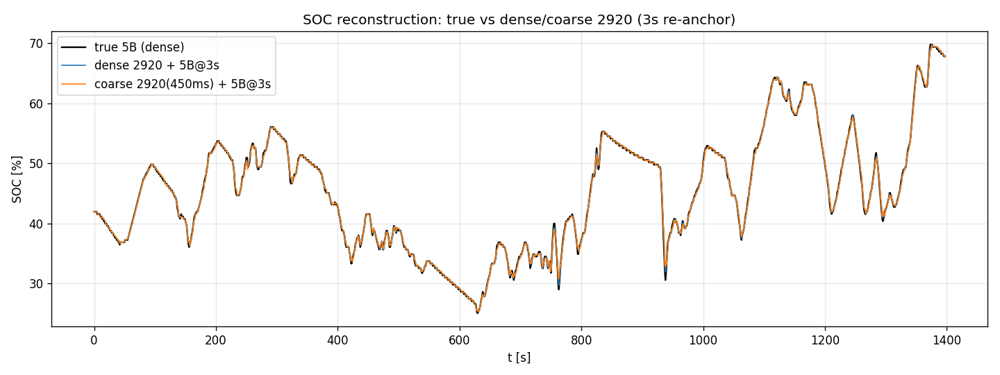

# FL4 SOC 内挿の検証メモ

replay の SOC を、疎な SOC ポーリング（5B）ではなく、密なバッテリ電力（2920 の pbat）の積算で内挿・同期させる手法の検証記録。実車ログ1本（fl4-obd-logger、FL4 e:HEV、冷間始動〜暖機〜市街地〜バイパス〜WOT〜回生、23.3分）に基づく。

## 1. 生データの素性

| 信号 | 取得 | 内容 | サンプリング |
|---|---|---|---|
| **2920** | UDS Service 22 拡張DID（ISO-TP マルチフレーム, TA 07） | 動作モード・各軸トルク・回転数・**pbat**（バッテリ電力, s16 off84 ×0.01 kW, 放電+/充電−） | 本ログ ~10Hz（13984フレーム、損失ゼロ・CF連番検証済・全フレーム固定長） |
| **5B** | Service 01（TA 07） | **SOC** = 100·A/255（8bit, 0.39%/LSB ≈ 2.5Wh/LSB） | 本ログは密（~10Hz）。ELM327 アプリでは ~3秒毎 |

- SOC スイング 25–70%（約45pt）。EV/SERIES/DIRECT/WOT/回生を網羅。
- 2920 は SN 連番＋宣言長で完全性を検証済み（取りこぼしゼロ）。積算の土台として信頼できる。

## 2. SOC↔kWh フィッティング

pbat を時間積分（∫Pbat [kWh]）し、SOC を回帰した。

- **SOC = −154 %/kWh × ∫Pbat、R² = 0.920**
- → 容量（SOC 0–100% 相当）≈ **0.649 kWh**、**1% SOC ≈ 6.5 Wh**
- 別途の DID 解析レポートの ~0.66 kWh と独立に一致。今回はスイングが大きく R² が改善（0.885→0.920）。

**線形性**：実用上リニア。ただし厳密には ±~2.5% SOC の緩い系統残差（微小な非線形 or ∫Pbat 積分ドリフト、1走行では分離不可）＋充放電で ~0.8% のヒステリシス（クーロン効率）が乗る。SOC帯別の局所傾きは大きく振れるが、これは各帯を充放電で往復した cycling アーティファクトであり真の非線形ではない（単調に動いた端は 6.5Wh/% で一致）。

## 3. 予測の一致性（5B間引き / 両間引き）

**復元方式**：実測5Bが来たら SOC を再アンカー、その間は ΔSOC = −154 × ∫Pbat（アンカー起点）で前進させる。

| 構成 | 中央 | p90 | 最大 | バイアス |
|---|---|---|---|---|
| 密2920 + 5B@3s | 0.21% | 0.54% | 1.97% | +0.01% |
| **粗2920(450ms≈ELM327 2Hz) + 5B@3s** | 0.23% | 0.62% | 2.13% | — |
| 純積算（アンカー無し・デッドレコニング） | — | — | 累積ドリフト 5–9% / 23分 | — |

- **5B を3秒アンカーにし密2920で埋めると SOC を中央 ~0.2% で再構成できる**。バイアスほぼゼロ。
- **2920 を ELM327 相当（2Hz）に間引いてもほぼ悪化しない**（中央 0.21→0.23%）。∫Pbat は3秒程度なら 450ms 間隔で十分に積める。
- **アンカー無しの純積算はドリフトする**ので、定期的な 5B 再アンカーは必須。

*3本（真値5B / 密2920+5B3s / 粗2920+5B3s）は全区間で重畳。乖離するのは WOT・急回生の鋭い過渡のみで、そこも3秒アンカーで即復帰。*

## 4. 5B をどこまで間引けるか（2920は ELM327 相当 2Hz のまま）

2920 を ELM327 で実際に取れているレート（~450ms≈2Hz）に保ったまま、5B アンカー間隔を掃引し、復元SOCと真値5Bの誤差を評価した。

| 5B間隔 | 中央 | p90 | 最大 |
|---|---|---|---|
| 3s | 0.15% | 0.46% | 2.54% |
| 5s | 0.20% | 0.60% | 2.71% |
| 10s | 0.29% | 0.99% | 4.87% |
| 20s | 0.44% | 1.40% | 4.31% |
| 30s | 0.57% | 1.70% | 4.87% |
| 60s | 0.98% | 2.29% | 4.43% |
| 120s | 1.18% | 2.89% | 5.25% |

- **明確なニーは無く、緩やかに劣化**。**中央誤差は30sまで<0.6%、~60sまで<1%**。p90 は30sまで<1.7%。
- 2920 を ELM327 相当（2Hz）にしても密2920とほぼ変わらない（3sで中央 0.15%、密と同等）。∫Pbat は2Hzでも十分な精度で積める。
- 復元は 2920 の ∫Pbat が担い、5B は遅いドリフト/ヒステリシスの補正だけを担うため、5B はかなり間引ける。
- 最大誤差（~4.5%）は WOT の過渡で、較正の限界点（極大電力での非線形/5B更新遅れ）。5B間隔への依存は弱い。

**実用的含意**：アプリの現状 5B@3s は保守的。**5B を 10–30秒毎に落としても（2920はそのままで）SOC 中央 <0.6%** を保てるので、ポーリング枠を 2920 側に回せる。

## 5. 実装

`replay.html` の `parseFrames` で、5B到来時に SOC を再アンカーし、その間を 2920 の pbat 積算（K=−154 %/kWh）で前進させて `soc` を作る。グラフの SOC パネル（`socPts`）とフロー図の BAT ノード（`D.soc`）は `o.soc` を参照するため、内挿値が自動で反映される。
