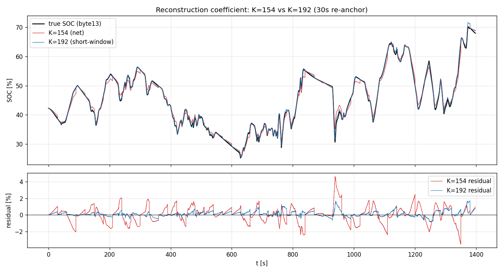
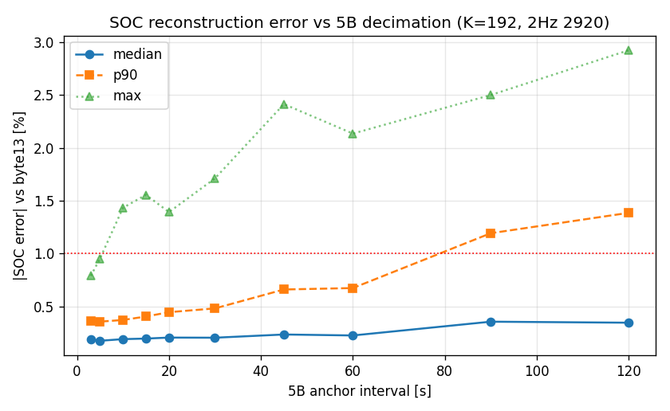
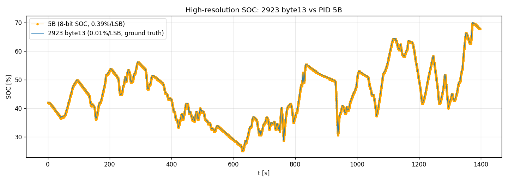

# FL4 SOC 内挿の検証メモ

replay/ライブアプリの SOC を、疎な SOC ポーリング（5B）ではなく、密なバッテリ電力（2920 の pbat）の積算で内挿・同期させる手法の検証記録。実車ログ1本（fl4-obd-logger、FL4 e:HEV、冷間始動〜暖機〜市街地〜バイパス〜WOT〜回生、23.3分、5B/2923/2920 各 ~14000 サンプル）に基づく。

**要点**：
- 内挿の較正係数は **K = −192 %/kWh**（短窓の実測係数。走行全体フィットの −154 ではない）。
- 較正の真値は **2923 byte13 = 0.01%/LSB の高分解能絶対SOC**（後述）。これで初めて厳密検証ができた。
- 充放電で係数を変える必要は無い（対称、§2）。
- K=192・5Bを30〜60秒まで間引いても **SOC 中央 <0.25%** で再構成できる。

## 1. 生データの素性

| 信号 | 取得 | 内容 | サンプリング |
|---|---|---|---|
| **2920** | UDS Service 22 拡張DID（ISO-TP マルチフレーム, TA 07） | 動作モード・各軸トルク・回転数・**pbat**（バッテリ電力, s16 off84 ×0.01 kW, 放電+/充電−） | 本ログ ~10Hz（13984フレーム、損失ゼロ・CF連番検証済・全フレーム固定長）。ELM327アプリでは ~2Hz |
| **5B** | Service 01（TA 07） | SOC = 100·A/255（8bit, **0.39%/LSB**） | 本ログは密。ELM327アプリでは 30秒毎 |
| **2923 byte13** | UDS Service 22（TA 07） | **高分解能絶対SOC** = 0.01000×u16(byte13) − 0.20（**0.01%/LSB**） | 本ログ ~10Hz。5B と r=0.9999（§4） |

- SOC スイング 25–70%（約45pt）。EV/SERIES/DIRECT/WOT/回生を網羅。
- 2920 は SN 連番＋宣言長で完全性を検証済み（取りこぼしゼロ）。積算の土台として信頼できる。
- **2923 byte13 が高分解能の絶対SOC**なので、これを真値に内挿誤差を %SOC 単位で厳密評価できる（従来は 8bit の 5B しか無く 0.39% の量子化に埋もれていた）。

## 2. 較正係数：内挿は −192、容量は −154（別物）

2923(真値)を基準に、30秒再アンカー再構成の誤差を最小化する単一Kをスイープすると **K ≈ −192 %/kWh**（1% ≈ 5.2 Wh）が最適。純放電窓・純充電窓から独立に推定しても **a_dis 191 / a_chg 193 ≒ 対称**で 192 に一致する。

- **充放電の非対称は無い**。当初「出し入れで係数を変える（2係数化）」で ~3.5倍改善したのは、非対称のおかげではなく **係数が 154→192 に上がったことが本体**だった（2係数の見かけの非対称は Edis/Echch の共線アーティファクト）。単一・対称の K=−192 で同じ改善が得られる（§3）。

一方、**走行全体で SOC vs 累積∫Pbat を回帰すると傾きは −154 %/kWh（R²0.920、容量 ≈0.649 kWh、1%≈6.5Wh）**。これは短窓の −192 とは別物で、**長時間積分の ∫Pbat ドリフトが乗った値**。

- **再構成はアンカー間の短区間を伝播する**ので、短窓の実測係数 **−192** が正しい。
- 容量・電費の議論に使う「SOC 0–100% ≈ 0.65 kWh」は net の −154 側（DID解析の ~0.66 kWh と独立一致）で、これはこれで妥当。**用途で係数が違う**点に注意。

## 3. 再構成の精度（vs 2923 真値）

**復元方式**：実測アンカー（5B）が来たら SOC を再アンカー、その間は ΔSOC = −192 × ∫Pbat（アンカー起点）で前進させる。

### 3.1 係数 K=154 vs K=192

30秒再アンカーで単一Kを振り、2923真値との残差を比較：

| K | 30s 中央 | p90 | 最大 | 10s 中央 |
|---|---|---|---|---|
| 154（走行全体フィット） | 0.55% | 1.55% | 4.65% | 0.20% |
| **192（短窓実測）** | **0.15%** | **0.53%** | **1.72%** | **0.07%** |

*上：真値(黒)に K=192(青)はほぼ張り付き、K=154(赤)はアンカー間で系統的に離れる。下：残差。K=154 は「窓内で一方向にドリフト→アンカーでリセット」の**系統的のこぎり波（±2〜4.6%）＝係数が低すぎるサイン**。K=192 でほぼ消える（±1%以内）。*

### 3.2 5B をどこまで間引けるか（2920は ELM327 相当 2Hz）

2920 を ELM327 の実レート（~2Hz）に保ち、5B アンカー間隔を掃引、K=192・vs 2923真値：

| 5B間隔 | 中央 | p90 | 最大 |
|---|---|---|---|
| 3s | 0.19% | 0.36% | 0.79% |
| 10s | 0.19% | 0.37% | 1.43% |
| 20s | 0.20% | 0.44% | 1.39% |
| **30s** | **0.20%** | **0.48%** | **1.71%** |
| 60s | 0.22% | 0.67% | 2.13% |
| 120s | 0.34% | 1.38% | 2.92% |

- **明確なニーは無く非常にフラット。中央誤差は 60秒まで <0.25%**、120秒でも 0.34%。復元の主役は 2920 の ∫Pbat で、5B は遅いドリフト補正だけを担うため大きく間引ける。
- 2920 を 2Hz にしても密2920とほぼ変わらない。∫Pbat は2Hzで十分積める。
- **アンカー無しの純積算はドリフトする**（5–9%/23分）ので定期再アンカーは必須。
- 最大誤差は WOT の鋭い過渡で出るが 30–60秒間隔でも <2%。

**実用的含意**：アプリは **5B を 30秒毎に落とし、2920 を主体に内挿**して十分（中央 <0.25%）。ポーリング枠を 2920 に回せる。

## 4. 2923 byte13 = 高分解能・絶対SOC

**2923 byte13(u16) = 0.01%/LSB の絶対SOC**（`SOC = 0.01000×byte13 − 0.20`、01_5B と **r=0.9999**、残差std 0.11%）。ECU は高分解能の絶対SOCを直接持っている。

*2923 byte13(青, 0.01%/LSB) と 5B(橙, 0.39%/LSB の階段)。byte13 が細かい真値を与える。*

- **Picoロガー**：2923 を取得済み＝byte13 で高分解能SOCが直読み（内挿は不要、内挿較正の真値にも使える）。
- **ELM327アプリ**：現状 2920 のみポーリング（2923 を叩くと 2920 レートが半減）。∫Pbat 内挿が追加ポーリング無しで中央 ~0.2% を出せるため、**アプリはこの内挿を維持**（byte13 直読みは採らない）。

※ 当初 byte13 を「相対エネルギー累積器(0.065Wh/LSB)」と誤同定していた（∫Pbat との相関 r−0.96 に引きずられた。SOC自体が∫Pbatと相関するため）。5B との直接照合で 0.01%/LSB の絶対SOCと訂正。

## 5. 実装

`replay.html` / `index.html` とも `SOC_K = −192`。5B（アプリは30秒毎）到来で SOC を再アンカーし、その間を 2920 の ∫Pbat×(−192) で前進させて表示・グラフに反映。**内挿値は表示専用、ログは生の 5B/2920 のみ**（内挿値は記録しない）。

## 6. 走行差と今後

- **−192 は電池のエネルギー/%（ほぼ固定物理量）**なので走行間で大きくは振れない想定。振れ要因は電池温度（低温で使用可能容量↓→K↑、数%）・経年劣化（年単位）。走行依存だったのは net−154 の方（∫Pbat 積分ドリフトが cycling 量で変動）。
- 本メモは1走行に基づく。**次走行以降は 2923 byte13 が真値をタダで与える**ので、K=192 の再現性を各走行で即チェックできる。温度で振れるなら温度補正を検討。
